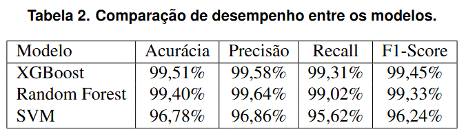
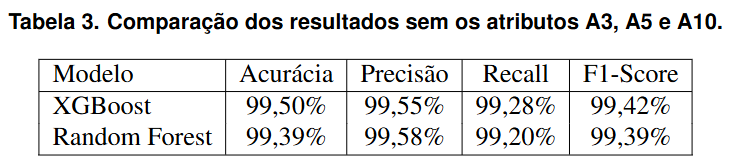
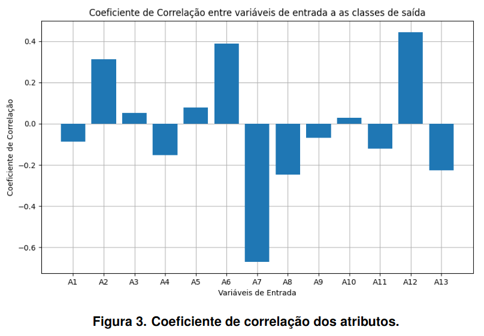

# Phishing Guardian - Detector de sites de Phishing

Este repositório está vinculado ao artigo submetido ao SBSeg 2025 "Phishing Guardian: Detecção de sites de phishing com Machine Learing". O artigo foi submetido à Trilha Principal da 25º edição do Simpósio Brasileiro em Segurança da Informação e de Sistemas Computacionais.

O phishing permanece como uma das ameaças cibernéticas de maior impacto financeiro e social. Este trabalho investiga a eficácia de técnicas de Machine Learning na detecção de URLs maliciosas, abordando lacunas relacionadas a bases de dados incompletas e comparações sistemáticas entre algoritmos. Utiliza-se uma base de dados de 50.261 URLs (55,5% maliciosas) coletadas de fontes públicas e varredura ativa. Os algoritmos Random Forest, XGBoost e SVM são treinados com validação cruzada, com o XGBoost alcançando 99,51% de acurácia. Foi desenvolvida uma ferramenta que contém o classificador e uma extensão de navegador que exibe alertas não intrusivos ao usuário, objetivando garantir uma boa experiência de utilização.

O classificador foi integrado a uma extensão que coleta e classifica URLs em tempo real, alertando o usuário sobre sites maliciosos.

* É importante destacar que apenas foram realizados testes significativos do uso da ferramenta em sistemas operacionais Windows e Linux, não tendo sido testada em ambientes MacOs, tendo apenas a garantia de funcionamento nos ambientes citados inicialmente.

Os ambientes de teste utilizados consistiram em máquinas virtuais geradas no VirtualBox com as seguintes configurações:

- Ubuntu 24.04.2 LTS - 4GB RAM - 2 núcleos de processador.
- Windows 10 - 4GB RAM - 2 núcleos de processador.
- Windows 11 - 4GB RAM - 2 núcleos de processador.

* Para esses ambientes o único foco foi a execução da ferramenta e realização de buscas de páginas web simples pelo navegador.

## Preocupações com segurança

Não há preocupações com segurança.

## Estrutura do README.md

- [Instalação](#instalação)
- [Teste Mínimo](#testemínimo)
- [Experimentos](#experimentos)
- [Reivindicações](#reivindicações-reprodução-da-ferramenta)
- [Gere sua própria chave de API do OpenPage Rank (Opcional)](#chave_api)
- [Licença](#license)

O repositório encontra-se de forma que contém os arquivos Python necessários para reprodução das métricas (metrics.py) e utilização da ferramenta gerada (code_analyze_trafic.py), além de possuir o arquivo de requirements para instalação das bibliotecas necessárias para execução do projeto. O repositório também conta com a pasta "url-collector-extension" que contém a extensão de navegador criada e as pastas que armazenam as bases de dados utilizadas.

## Selos Considerados

    - Selo D - Artefatos Disponíveis: Os códigos, juntamente com um arquivo README.md estão disponíveis em um repositório público no GitHub;
    - Selo F - Artefatos Funcionais: Os códigos disponibilizados podem ser executados e os tutoriais de execução se encontram presentes no arquivo README.md;
    - Selo R - Artefatos Reprodutíveis: Os dados fornecidos no artefato são passíveis de reprodução através dos códigos disponibilizados através do repositório do GitHub.
    - Selo S - Artefatos Sustentáveis: Artefato inteligível e de fácil compreensão.

## Informações básicas

Para reprodução da ferramenta será necessário que o usuário possua o Python instalado, preferencialmente, na versão mais recente no momento da utilização. As bibliotecas utilizadas estão no arquivo "requirements.txt" para instalação, sendo elas:

matplotlib

mitmproxy

numpy

pandas

Requests

scapy

scikit_learn

whois

psutil

memory-profiler

xgboost

O usuário precisará acessar o terminal, instalar as bibliotecas com o requirements.txt e iniciar a execução do arquivo "code_analyse_trafic.py". Também será necessário importar a extensão de navegador no Google Chrome (ferramenta disponivel apenas para esse navegador) e mantê-la ativa. O passo a passo de instalação descreve como isto poderá ser executado.

A princípio não foram mapeados requisitos mínimos de hadware, qualquer que sejam as configurações do usuário o mesmo poderá executar a ferramenta, desde que realize devidamente as instalações aqui indicadas.

## Dependências

As dependências necessárias para a execução da ferramenta incluem possuir instalado a linguagem de programação Python e as bibliotecas descritas anteriormente. Abaixo, estão descritas as versões de cada biblioteca utilizada:

- matplotlib: 3.9.0
- mitmproxy: 10.3.0
- numpy: 1.26.4
- pandas: 2.2.2
- Requests: 2.32.3
- scapy: 2.5.0
- scikit_learn: 1.5.0
- whois: 1.20240129.2
- psutil: 6.0.0
- memory-profiler: 0.61.0
- xgboost: 3.0.0

## Instalação

Para instalar o projeto, siga estes passos:

1. Garanta que você possui o Python instalado em sua máquina:

    Durante os testes, foram obtidos problemas com a versão 3.13 do Python para execução da ferramenta, sendo assim, recomenda-se a utilização da versão 3.12.

    Abra o terminal e digite: 

    ```bash
    python3.12 --version
    ```

    Caso seja retornada a versão 3.12 do Python, está tudo ok. Caso você não tenha instalado ainda, siga os seguintes passos:

    - Windows:

    Acesse o site oficial:

    ```bash
    https://www.python.org/downloads/
    ```
    Busque pela versão 3.12 e clique no botão para fazer download, depois siga os passos de instalação e volte ao passo inicial para verificar a versão do Python e se certificar de que a instalação foi feita corretamente.

    - Linux:

    Digite o seguinte comando no terminal:

    ```bash
    sudo apt-get install python3.12
    ```

    Refaça o passo inicial para verificar a versão instalada e garantir que a instalação ocorreu corretamente.

2. Clone o repositório através do comando:

    ```bash
    git clone https://github.com/bguarizi/phishing-guardian.git
    ```

    Acesse o repositório baixado:

    ```bash
    cd phishing-guardian/
    ```

3. Crie uma venv e ative-a:

    ```bash
    python3.12 -m venv venv
    ```

    - Linux:

    ```bash
    source venv/bin/activate
    ```

    - Windows:

    ```bash
    .\venv\Scripts\Activate
    ```

4. Faça a instalação das bibliotecas necessárias:

   Instale o arquivo requirement.txt através do pip com o seguinte comando:

    ```bash
    pip install -r requirements.txt
    ```

5. Faça download do Google Chrome:

    Caso ainda não possua o navegador instalado, siga os passos a seguir para realizar a instalação:

    Acesse o site oficial:

    ```bash
    https://www.google.com/chrome/
    ```

    Escolha o seu sistema operacional e siga os passos de instalação disponibilizados pelo site.

6. Adicione a extensão ao seu navegador Google Chrome:

    Abra seu navegador e acesse:

    ```bash
    chrome://extensions/
    ```

    Clique para ativar o modo desenvolvedor no canto superior direito
    Clique no botão "Carregar sem compactação" e vá até o caminho da pasta que acabou de clonar do projeto.
    Selecione a pasta "url-collector-extension" e clique em "Abrir".

    Sua extensão já estará funcionando!


## TesteMínimo

Após a instalação ter sido realizada corretamente, basta apenas ativar a execução do código em Python:

1. Abra novamente o terminal na pasta do projeto que foi baixado:

    Após estar na pasta em questão, rode o seguinte comando:

    ```bash
    python code_analyse_trafic.py
    ```

    Aguarde até que a tela mostre que o servidor está ativo na porta 5000.

3. Teste seu navegador:

    Abra o Google Chrome e começe a navegar. 
    Serão emitidos alertas em tempo real sobre as páginas que estão sendo acessadas.

OBS1.: Os alertas podem demorar alguns segundos para serem emitidos.

OBS2.: A cada site acessado, um alerta será emitido e este sumirá sozinho após alguns segundos.

OBS3: Caso queira desativar os alertas emitidos, basta cancelar a execução do script no terminal e desativar a extensão do navegador acessando novamente "chrome://extensions/" e desativando ou excluindo a extensão.

OBS4.: Caso não tenha sites de phishing para que possa testar, acesse a pasta do projeto em 'findphishing/d_base/phishStats04_07_24.csv'. Este é um arquivo coletado do site da PhishScore no dia 04/07/2024. Levando em consideração que esta não foi uma das bases de dados utilizada no treinamento e teste do classificador, é possível validar as classificações com as URLs contidas nele.

4. Caso queira realizar a coleta atualizada da base de dados da PhishStats para utilização nos testes:

    Acesse o seu navegador e pesquise por:

    ```bash
    https://phishstats.info/
    ```

    Na parte de baixo do site você encontrará o "CSV Feed", clique no botão "Go" e realize o download do arquivo csv contendo as URLs classificadas como phishing pela PhishStats.


## Experimentos

Além do código para ser executado, também é disponibilizado o código que mostra os valores finais das métricas do modelo: acurácia, recall, precisão e F1 Score. Além de também mostrar o gráfico de Coeficiente de Correlação.

1. Para executá-lo, acesse no terminal a pasta do projeto e digite o seguinte comando:

    ```bash
    python metrics.py
    ```

2. E selecione a opção desejada.


Uma vez que a reprodução do presente artefato não demanda de muito tempo para execução, sendo necessário no máximo 1 hora para instalação e execução da ferramenta, as reinvindicações aqui apresentadas envolvem todo o processo de execução da ferramenta e reprodução das métricas demonstradas no artigo.

## Reivindicações #Reprodução da Ferramenta

Para instalar o projeto, siga estes passos:

1. Garanta que você possui o Python instalado em sua máquina:

    Durante os testes, foram obtidos problemas com a versão 3.13 do Python para execução da ferramenta, sendo assim, recomenda-se a utilização da versão 3.12.

    Abra o terminal e digite: 

    ```bash
    python3.12 --version
    ```

    Caso seja retornada a versão 3.12 do Python, está tudo ok. Caso você não tenha instalado ainda, siga os seguintes passos:

    - Windows:

    Acesse o site oficial:

    ```bash
    https://www.python.org/downloads/
    ```
    Busque pela versão 3.12 e clique no botão para fazer download, depois siga os passos de instalação e volte ao passo inicial para verificar a versão do Python e se certificar de que a instalação foi feita corretamente.

    - Linux:

    Digite o seguinte comando no terminal:

    ```bash
    sudo apt-get install python3.12
    ```

    Refaça o passo inicial para verificar a versão instalada e garantir que a instalação ocorreu corretamente.

2. Clone o repositório através do comando:

    ```bash
    git clone https://github.com/bguarizi/phishing-guardian.git
    ```

    Acesse o repositório baixado:

    ```bash
    cd phishing-guardian/
    ```

3. Crie uma venv e ative-a:

    ```bash
    python3.12 -m venv venv
    ```

    - Linux:

    ```bash
    source venv/bin/activate
    ```

    - Windows:

    ```bash
    .\venv\Scripts\Activate
    ```

4. Faça a instalação das bibliotecas necessárias:

   Instale o arquivo requirement.txt através do pip com o seguinte comando:

    ```bash
    pip install -r requirements.txt
    ```

5. Faça download do Google Chrome:

    Caso ainda não possua o navegador instalado, siga os passos a seguir para realizar a instalação:

    Acesse o site oficial:

    ```bash
    https://www.google.com/chrome/
    ```

    Escolha o seu sistema operacional e siga os passos de instalação disponibilizados pelo site.

6. Adicione a extensão ao seu navegador Google Chrome:

    Abra seu navegador e acesse:

    ```bash
    chrome://extensions/
    ```

    Clique para ativar o modo desenvolvedor no canto superior direito
    Clique no botão "Carregar sem compactação" e vá até o caminho da pasta que acabou de clonar do projeto.
    Selecione a pasta "url-collector-extension" e clique em "Abrir".

    Sua extensão já estará funcionando!

Após a instalação ter sido realizada corretamente, basta apenas ativar a execução do código em Python:

7. Abra novamente o terminal na pasta do projeto que foi baixado:

    Após estar na pasta em questão, rode o seguinte comando:

    ```bash
    python code_analyse_trafic.py
    ```

    Aguarde até que a tela mostre que o servidor está ativo na porta 5000.

8. Teste seu navegador:

    Abra o Google Chrome e começe a navegar. 
    Serão emitidos alertas em tempo real sobre as páginas que estão sendo acessadas.

OBS1.: Os alertas podem demorar alguns segundos para serem emitidos.

OBS2.: A cada site acessado, um alerta será emitido e este sumirá sozinho após alguns segundos.

OBS3: Caso queira desativar os alertas emitidos, basta cancelar a execução do script no terminal e desativar a extensão do navegador acessando novamente "chrome://extensions/" e desativando ou excluindo a extensão.

## Reivindicações #Reprodução das Métricas

É disponibilizado o código que mostra os valores finais das métricas do modelo: acurácia, recall, precisão e F1 Score. Além de também mostrar o gráfico de Coeficiente de Correlação.

Para instalar o projeto, siga estes passos: (Caso já tenha feito anteriormente pule para o passo 5)

1. Garanta que você possui o Python instalado em sua máquina:

    Durante os testes, foram obtidos problemas com a versão 3.13 do Python para execução da ferramenta, sendo assim, recomenda-se a utilização da versão 3.12.

    Abra o terminal e digite: 

    ```bash
    python3.12 --version
    ```

    Caso seja retornada a versão 3.12 do Python, está tudo ok. Caso você não tenha instalado ainda, siga os seguintes passos:

    - Windows:

    Acesse o site oficial:

    ```bash
    https://www.python.org/downloads/
    ```
    Busque pela versão 3.12 e clique no botão para fazer download, depois siga os passos de instalação e volte ao passo inicial para verificar a versão do Python e se certificar de que a instalação foi feita corretamente.

    - Linux:

    Digite o seguinte comando no terminal:

    ```bash
    sudo apt-get install python3.12
    ```

    Refaça o passo inicial para verificar a versão instalada e garantir que a instalação ocorreu corretamente.

2. Clone o repositório através do comando:

    ```bash
    git clone https://github.com/bguarizi/phishing-guardian.git
    ```

    Acesse o repositório baixado:

    ```bash
    cd phishing-guardian/
    ```

3. Crie uma venv e ative-a:

    ```bash
    python3.12 -m venv venv
    ```

    - Linux:

    ```bash
    source venv/bin/activate
    ```

    - Windows:

    ```bash
    .\venv\Scripts\Activate
    ```

4. Faça a instalação das bibliotecas necessárias:

   Instale o arquivo requirement.txt através do pip com o seguinte comando:

    ```bash
    pip install -r requirements.txt
    ```

5. Para executar a visualização das métricas, acesse no terminal a pasta do projeto e digite o seguinte comando:

    ```bash
    python metrics.py
    ```

6. E selecione a opção desejada.

Os resultados obtidos pela execução desta reinvindicação encontram-se dispostos no artigo desenvolvido, sendo elas:

Em relação aos resultados das métricas de cada modelo elaborado, seguem a tabela mostrada a seguir:



Também são apresentados os resultados das métricas dos modelos XGBoost e Random Forest com a remoção dos atributos A3, A5 e A10, sendo demonstradas pela tabela:



Além de também ser possível reproduzir o coeficiente de correlação demonstrado:



## Chave API

Esta seção irá demonstrar como você pode gerar e utilizar sua própria chave de API do OpenPage Rank (solução utilizada para coletar o PageRank das páginas acessadas).

Atualmente o código possui uma chave de API disponibilizada pelos autores para que qualquer usuário possa executar os devidos testes e utilizar a ferramenta sem problemas iniciais. Caso o usuário deseje fazer o uso recorrente desta ferramenta, recomenda-se a criação de uma chave de API própria para consumo de requisições.

1. Acesse a página do OpenPage Rank e crie um acesso próprio para você:

https://www.domcop.com/openpagerank/auth/signup

2. Após fazer login, acesse "API Key" no menu de navegação

3. Copie a chave de API mostrada

4. Acesse o código da ferramenta "code_analyze_trafic.py" que baixou deste repositório e busque pela linha que contém o seguinte texto: 'API-OPR'.

5. Substitua a chave de API contida neste campo pela chave gerada em sua conta do OpenPage Rank.

## LICENSE

Copyright (c) [2025] [bguarizi]

Este código pode ser livremente utilizado, modificado e distribuído, inclusive para fins comerciais, desde que este aviso de direitos autorais seja mantido.

Este software é fornecido “como está”, sem qualquer garantia, expressa ou implícita, incluindo, sem limitação, garantias de comercialização ou adequação a um propósito específico. Os autores não se responsabilizam por quaisquer danos ou prejuízos decorrentes do uso deste software.


